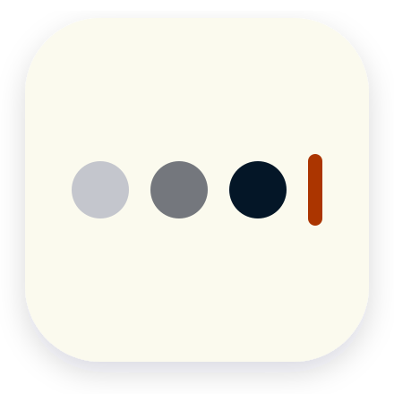

<p align="center">
  
</p>

<h1 align="center">Ink & Echo 📝🎭</h1>

<p align="center">
  <a href="https://github.com/lagosproject/InkAndEcho/actions">
    
  </a>
  <a href="https://opensource.org/licenses/MIT">
    
  </a>
  <a href="https://kotlinlang.org/">
    
  </a>
  <a href="https://developer.android.com/">
    
  </a>
</p>


Ink & Echo is a skeuomorphic, cooperative storytelling game for Android. Players pass the phone around, writing consecutive parts of a story while only seeing a small "echo" (the last few words) of what the previous writer contributed.

---

## 📋 Table of Contents
- [About the Project](#-about-the-project)
- [Features](#-features)
- [Automated Screenshot Pipeline](docs/screenshots_pipeline.md)
- [Prerequisites](#-prerequisites)
- [Getting Started & Installation](#-getting-started--installation)
- [Usage & Rules](#-usage--rules)
- [Configuration](#-configuration)
- [Contributing](#-contributing)
- [License](#-license)

---

## 📖 About the Project

Ink & Echo brings the classic parlor game of "Exquisite Corpse" (cadáver exquisito) to your Android device with a beautiful, tactile design. It features typewriter sounds, a dotted grid stationery aesthetic, and physical-like mechanical buttons that make writing feel authentic and satisfying.

## ✨ Features
- **Turn-based gameplay:** Support for 2 to 10 players on a single device.
- **Adjustable Hint Length:** Customize the number of words echoed to the next writer (1, 3, or 5 words).
- **Tactile UI:** Dotted paper grid backgrounds, skeuomorphic buttons, and physical feedback.
- **Audio Feedback:** Real typewriter key clicks and carriage return sound effects.
- **Story Archive:** Saves and formats all completed stories for reading.

---

## 🛠️ Prerequisites

To build and run this project, you will need:
- **Android Studio** (Jellyfish or newer recommended)
- **JDK 17** installed and configured
- **Android SDK Platform 34** (targetSdk)
- An Android device or emulator running **API 26 (Android 8.0)** or higher

---

## 🚀 Getting Started & Installation

1. **Clone the repository:**
   ```bash
   git clone https://github.com/lagosproject/InkAndEcho.git
   cd InkAndEcho
   ```

2. **Open the project in Android Studio:**
   - Go to `File -> Open` and select the root directory of the project.
   - Wait for Gradle to finish syncing.

3. **Build the Debug APK:**
   ```bash
   ./gradlew assembleDebug
   ```

4. **Run on device/emulator:**
   - Click the **Run** button in Android Studio, or execute:
     ```bash
     ./gradlew installDebug
     ```

---

## 🎮 Usage & Rules

1. **Start the Game:** Select the number of scribblers and preferred hint length.
2. **First Prompt:** Input a starting prompt (or use the default) to kickstart the story.
3. **Pass the Phone:** Once a writer seals their scroll, they hand the device to the next player. The next player will only see the "echo" of the last words typed.
4. **Read the Masterpiece:** When all turns are complete, the fully compiled story is added to the **Archive** where everyone can read it.

---

## ⚙️ Configuration

Local configurations such as SDK paths should be specified in your `local.properties` file:
```properties
sdk.dir=/path/to/your/android/sdk
```

For release signing, create a `keystore.properties` file in the root directory (never commit this file to version control):
```properties
storePassword=<YOUR_STORE_PASSWORD>
keyPassword=<YOUR_KEY_PASSWORD>
keyAlias=<YOUR_KEY_ALIAS>
storeFile=<YOUR_KEYSTORE_FILE_NAME>.jks
```

---

## 🤝 Contributing

Contributions make the open-source community an amazing place to learn, inspire, and create. Please read [CONTRIBUTING.md](CONTRIBUTING.md) to learn how to propose changes, report bugs, or request features.

---

## 📄 License

Distributed under the MIT License. See [LICENSE](LICENSE) for more information.
